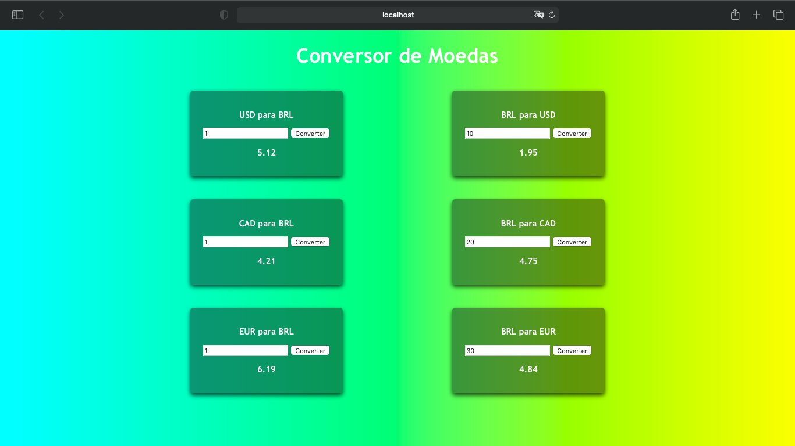
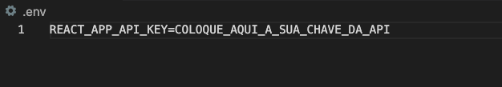

## Conversor de Moedas em React.JS
  

Este projeto de Conversor de Moedas foi utilizado React.JS para construção, consumindo uma API extraída da Free Currency Converter API.




### Instalação:
```
npm install
npm run start

```

### Observações:

Será necessário que você acesse o site: https://free.currencyconverterapi.com


Cadastre-se para receber um email com o ID da sua API
Copie o seu ID (no seu email) e cole no local indicado em ```.env```




